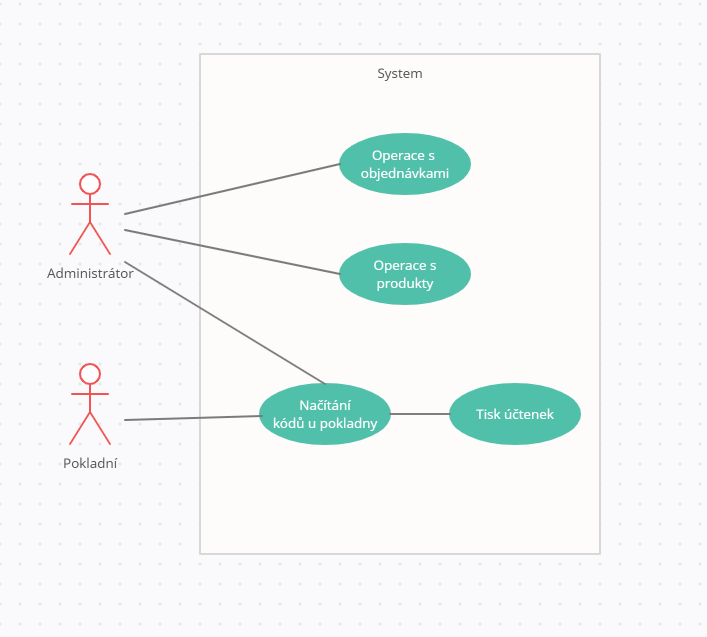
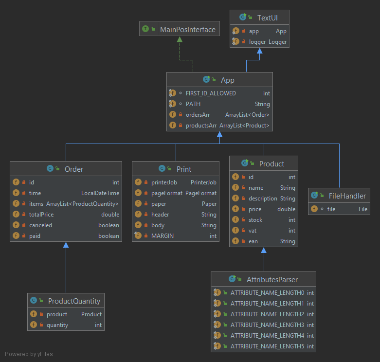

## English description -WIP

## Zadání

Aplikace POS.ED je jednoduchou POS aplikací. Tento projekt byl vypracován pro kurz ALG2 Technická univerzita v Liberci. Aplikace zpracovává dva soubory. První obsahuje informace o objednávkách. Druhý obsahuje informace o položkách na skladě. Soubory lze načíst z binárního souboru nebo ze souboru JSON. Objednávky a položky lze vypisovat, řadit, přidávat a odebírat. Objednávka může být následně vypsána jako účtenka.

## Návrh řešení

### Use case 

### Funkční specifikace

- Ukládejte a načítejte soubory z binárních souborů nebo souborů JSON
- Produkt
	- Upravte produkt
	- Vytvořte produkt
	- Odeberte produkt
	- Zobrazte informace o produktu skenováním EAN
	- Vyhledejte produkt
	- Zobrazit všechny produkty seřazené podle atributu
 - Objednávka
	 - Vytvořte objednávku 
	 - Přidejte produkty na objednávku
	 - Zobrazit poslední objednávku 
	 - Zobrazit všechny objednávky 
	 - Zpracovat objednávku
- Pokladna
	- Načítání EAN kódů
	- Tisk účtenek 

### Objektový model

### Datové struktury
#### Product
	{
	   "id":product_id,
	   "name":"product_name",
	   "description":"product_description",
	   "price":product_price,
	   "stock":product_stock,
	   "vat":product_vat,
	   "ean":"product_ean"
	}
#### Order
 

    {
          "id":1000,
          "time":[
             year,
             month,
             day,
             hour,
             minute,
             second,
             ms
          ],
          "items":[
             {
                "product":{
                   "id":product_id,
				   "name":"product_name",
				   "description":"product_description",
				   "price":product_price,
				   "stock":product_stock,
				   "vat":product_vat,
				   "ean":"product_ean"
                },
                "quantity":item_quantity
             }
             //next product...
             //and so on...
          ],
          "totalPrice":totalPrice,
          "canceled":false,
          "paid":false
       }

## Externí knihovny

    <dependencies>  
     <dependency> <groupId>com.fasterxml.jackson.core</groupId>  
     <artifactId>jackson-databind</artifactId>  
     <version>2.12.3</version>  
     </dependency> <dependency> <groupId>com.fasterxml.jackson.datatype</groupId>  
     <artifactId>jackson-datatype-jsr310</artifactId>  
     <version>2.12.3</version>  
     </dependency>  
    </dependencies>

## Testování

