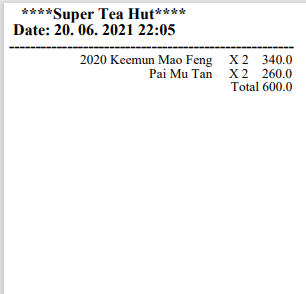

# Testování
## Část 1.
       === MENU === 
             1. Save and load files 
             2. Products menu
             3. Orders menu
             4. Cash register 
             0. Exit 
      1
       === SAVE/LOAD MENU === 
             1. Save .bin to standard path 
             2. Load .bin from standard path 
             3. Save .json to standard path 
             4. Load .json from standard path 
             0. Exit 
      4
       === SAVE/LOAD MENU === 
             1. Save .bin to standard path 
             2. Load .bin from standard path 
             3. Save .json to standard path 
             4. Load .json from standard path 
             0. Exit 
      0
       === MENU === 
             1. Save and load files 
             2. Products menu
             3. Orders menu
             4. Cash register 
             0. Exit 
      2
       === PRODUCTS MENU === 
             1. Create product 
             2. Edit product 
             3. Remove product 
             4. View product information by scanning EAN 
             5. Search product 
             6. View all products sorted by attribute
             0. Exit 
      6
      Enter an attribute to witch should be list sorted. Options are name, price, stock. Default/none is sorted by id 
      price
      id=1000;name=Pai Mu Tan;description=white tea - 100g;price=130.0;stock=15;vat=15; ean=14648645325135
      id=1003;name=2021 Dian Hong Jin Zhen;description="Zlaté jehličky" – výtečná sorta červeného čaje z oblasti Menghai v provincii Yunnan. ;price=160.0;stock=100;vat=15;ean=215847773558587
      id=1004;name=2020 Keemun Mao Feng;description=černý čaj z oblasti Keemun;price=170.0;stock=51;vat=15;ean=665467684843843
      id=1002;name=Darjeeling FTGFOP-1;description=Velmi dobrý darjeelingský čaj z jarní sklizně (First Flush) z organické zahrady Risheehat;price=260.0;stock=35;vat=15;ean=6846858697878
      id=1001;name=2021 Du Yun Mao Jian;description=Ochmýřené tipsy z Du Yun - Pečlivě zpracovaný čaj drobného lehce zakrouceného listu s přiměřeným podílem tenkých stříbřitých tipsů.;price=330.0; stock=25;vat=15;ean=68468543558

       === PRODUCTS MENU === 
             1. Create product 
             2. Edit product 
             3. Remove product 
             4. View product information by scanning EAN 
             5. Search product 
             6. View all products sorted by attribute
             0. Exit 
## Část 2.

     === ORDERS MENU === 
       1. Create order 
       2. Add products to order 
       3. View last order 
       4. View all orders
       5. Process order
       0. Exit 
    1
    To create order, enter IDs of products to add them to Order. You    can add as many products as you want. If you want to quit enter 0
    1000
    1000
    1001
    1004
    0
    1003
     === ORDERS MENU === 
       1. Create order 
       2. Add products to order 
       3. View last order 
       4. View all orders
       5. Process order
       0. Exit 
        4
        id=1000;time=26.05.2021 - 01:11:06;items=[ProductQuantity{product=id=1000;name=Pai Mu Tan;description=white tea - 100g;price=130.0;stock=15;vat=15;ean=14648645325135, quantity=1}];totalPrice=130.0;canceled=false;paid=false
        id=1001;time=26.05.2021 - 12:42:51;items=[ProductQuantity{product=id=1000;name=Pai Mu Tan;description=white tea - 100g;price=130.0;stock=15;vat=15;ean=14648645325135, quantity=1}];totalPrice=130.0;canceled=false;paid=false
    id=1002;time=04.06.2021 - 00:41:11;items=[ProductQuantity{product=id=1004;name=2020 Keemun Mao Feng;description=černý čaj z oblasti Keemun;price=170.0;stock=51;vat=15;ean=665467684843843, quantity=3}, ProductQuantity{product=id=1000;name=Pai Mu Tan;description=white tea - 100g;price=130.0;stock=15;vat=15;ean=14648645325135, quantity=3}];totalPrice=900.0;canceled=false;paid=false
    id=1003;time=20.06.2021 - 22:01:44;items=[ProductQuantity{product=id=1004;name=2020 Keemun Mao Feng;description=černý čaj z oblasti Keemun;price=170.0;stock=51;vat=15;ean=665467684843843, quantity=1}, ProductQuantity{product=id=1001;name=2021 Du Yun Mao Jian;description=Ochmýřené tipsy z Du Yun - Pečlivě zpracovaný čaj drobného lehce zakrouceného listu s přiměřeným podílem tenkých stříbřitých tipsů.;price=330.0;stock=25;vat=15;ean=68468543558, quantity=1}, ProductQuantity{product=id=1000;name=Pai Mu Tan;description=white tea - 100g;price=130.0;stock=15;vat=15;ean=14648645325135, quantity=2}];totalPrice=760.0;canceled=false;paid=false

     === ORDERS MENU === 
           1. Create order 
           2. Add products to order 
           3. View last order 
           4. View all orders
           5. Process order
           0. Exit 
    5
    Order id:
    1003
    Order processed
     === ORDERS MENU === 
           1. Create order 
           2. Add products to order 
           3. View last order 
           4. View all orders
           5. Process order
           0. Exit 
## Část 3.

     === ORDERS MENU === 
           1. Create order 
           2. Add products to order 
           3. View last order 
           4. View all orders
           5. Process order
           0. Exit 
    0
     === MENU === 
           1. Save and load files 
           2. Products menu
           3. Orders menu
           4. Cash register 
           0. Exit 
    4
    Enter EAN codes for products, type "exit" to end input, "print"     to process and print bill:
    14648645325135
    14648645325135
    665467684843843
    665467684843843
    print
    exit
     === MENU === 
           1. Save and load files 
           2. Products menu
           3. Orders menu
           4. Cash register 
           0. Exit 
